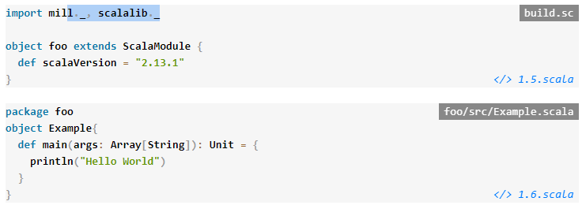

<center><font size=8>动手学Scala</font></center>
***

[TOC]

```scala
package app
object MinimalApplication extends cask.MainRoutes{
  @cask.get("/")
  def hello() = {
    "Hello World!"
  }

  initialize()
}
```

《动手学Scala》以实用的、基于项目的方式教你如何使用Scala编程语言。本书旨在让有经验的软件工程师快速掌握使用Scala构建各种生产应用程序所需的一切知识。

通过本书的学习，你不仅可以熟悉Scala语言本身，还可以学习到任何专业使用Scala语言的人所必须的具体技能：处理文件和进程、JSON和结构化数据、第三方API、Web服务器、数据库、并发等。《动手学Scala》将引导你完成几个不简单的项目，这些项目反映了你可能在软件工程工作中最终构建的应用程序，因此你可以快速地使用Scala专业地进行实际操作。

(代码片段：一个小小的Scala Web应用程序示例，是本书中我们会遇到的众多Scala程序之一)

***

在《动手学Scala》课程中，你将会通过几个动手项目来完成：

- 一个增量静态网站生成器
- 一个使用Github API的项目迁移工具
- 一个并行的网络爬虫
- 一个由数据库支持的互动式聊天网站
- 实时网络化的文件同步器
- 一个编程语言解释器

《动手学Scala》并非试图培养Scala语言本身的深层细节方面的专业知识，而是要在广泛的领域和场景中使用Scala来培养专业知识。

<a id="1.1"></a>
## 1.1 预期听众

《动手学Scala》假定你是已经有使用另一种编程语言的经验的软件开发人员，并且希望快速使用Scala工作的高产者。 比如：

- 需要使用Apache Spark这样的软件进行一些大数据处理的开发者，而这些软件需要与Scala集成。

- 加入了使用Scala的公司，需要快速上手，并在代码库中提高工作效率的人。

- Ruby或Python开发人员遇到性能问题，希望迁移到更快的编译语言，同时又不放弃脚本语言提供的方便和易用性。

- Java开发人员发现该语言会使他们的开发速度变慢，他们需要一种既能快速开发，又不失去他们所依赖的库的编译时检查和生态系统的语言。

- 有Scala语言工作经验的人，但希望获得更多的经验，能够独立设计和实施使用Scala的系统。

  在所有这些情况下，《动手学Scala》都能让你快速上手并运行。

注意，本书并不是针对完全的编程新手。我们希望你能熟悉基本的编程概念：变量、整数、条件、循环、函数、类、方法等。我们会涉及到这些概念在Scala中的不同表现，但前提是你已经对它们的工作原理有了基本的理解。

<a id="1.2"></a>
## 1.2 为什么是Scala?

Scala是一种简洁的高级语言。Scala的静态类型有助于避免复杂应用程序中的错误，它运行在JVM(Java虚拟机)可以让你构建高性能的系统，并且可以轻松访问庞大的工具和库生态系统。

### 1.2.1 一个让人感到活力的编译语言

大多数语言属于脚本语言到编译语言的范畴。像Python或Ruby这样的脚本语言往往在小型项目中使用起来很方便，但它们也很慢，在大规模部署时可能会造成问题。编译语言如Java、Go或C++则恰恰相反：通常性能很好，但在小型应用或原型开发中使用起来很不方便。

凭借Python的便捷性和Go的性能和可扩展性，Scala为你提供了两个世界的最佳选择。Scala 的简洁性使快速原型设计成为一种乐趣，而其优化的编译器和快速的 JVM 运行提供了出色的性能，可以支持最繁重的生产工作负载。

### 1.2.2 一门可扩展的语言

Scala 是一门从单行代码片段到百万行生产代码库的语言。Scala的交互式命令行使探索性编程变得快速而简单，而其强大的类型检查器有助于防止在复杂的关键任务系统中工作时出现缺陷。

做一些一次性的文件操作？剪裁一些HTML网站？构建一个分布式后端系统，与几十个第三方服务交互？Scala可以做到这一切!

### 1.2.3 一个广泛而深入的生态系统

作为一种运行在Java虚拟机上的语言，Scala可以访问庞大的Java生态系统中的标准库和工具，这些库和工具是你构建生产应用程序时不可避免的需要。无论你是在寻找Protobuf解析器、机器学习工具包、数据库访问库、查找瓶颈的剖析器，还是生产应用程序的监控工具，你都能找到你所需要的一切生产应用程序。

虽然每一种语言都有其优势、弱点和特定的**利基**，但Scala是一门优秀的 "通用 "语言，可以很好地服务于各种用例。从REPL中的交互式编程，到使用Apache Spark进行数据科学和大数据处理，再到构建大型复杂的后端系统，Scala都非常适合。本书将教你如何使用它。

<a id="1.3"></a>
## 1.3 为什么选择这本书？

《动手学Scala》的目标是带领专业的软件工程师，让他们以最快的速度使用Scala编程语言提高工作效率。

### 1.3.1 超越Scala语言

大多数现有的Scala书籍都集中在教你如何使用这门语言。然而，当建立一个网站、与第三方API集成或简单的应用程序时，了解语言的细节并不是必要的，也不是足够的。《动手学Scala》旨在弥补这一缺陷。

本书的内容超出了Scala语言本身，还涵盖了在典型的实际工作中使用Scala所需要的各种工具和库。其中有些是由作者维护的开源项目，有些则是由Scala社区的其他成员维护的。在所有情况下，这些工具和库都将是稳定的、广泛使用的工具和库，并将为我们使用Scala构建有用的软件的目标打下坚实的基础。

无论是学习如何配置构建工具，查询数据库，还是处理常见的数据格式，《动手学Scala》都将确保你拥有必要的支持技能，使你能够充分利用Scala语言。

### 1.3.2 专注于真实项目

《动手学Scala》每一章都是以项目为中心：每一章都是以Scala中的一个小项目为基础，以完成一些即时有用的东西。这些项目有两个目的：激励你学习每一章中的工具和技术，同时也是为了建立你的工程工具箱。

每个项目都是基于一个使用Scala构建的实际应用。例如，我们在第20章构建的解释器：基于开源的Sjsonnet编译器实现一门编程语言：

- https://github.com/databricks/sjsonnet

本书中的 API 客户端、Web 剪切器、文件同步器、静态网站生成器、Web 应用程序和其他项目都是基于 Scala 实现的真实项目。这种对项目的重视意味着，到本书结束时，你不仅能掌握使用Scala进行生产工作所需的技能，而且还能拥有做过类似工作的经验。

作为一个读者，我们希望你能在整个章节中跟着代码一起学习：这意味着你要打开你的终端和编辑器，输入并执行给出的代码示例。为了方便起见，我们提供了Github上的代码示例链接，你可以复制粘贴到你的编辑器或控制台中。确保你执行代码并看到它的工作状态，让你自己感受一下代码的工作状态。

### 1.3.3 极致的策划

与其说是为了内容的数量而优化，不如说是为了质量而优化。每一章、每一页和每一段都经过无数次的编写和重写，以提供最流畅的学习体验。千余页的内容，经过无数次的编写和废弃，才有了现在这本书的400页。

《动手学Scala》中的内容经过了不同背景和经验的软件工程师和计算机科学家的全面审查。他们的反馈有助于将本书整合成一本紧凑、连贯的Scala语言入门书。

《动手学Scala》承认，作为一个读者，你的时间是宝贵的。你可以肯定的是，在这本书中，你不会发现任何多余的文字或空洞的散文：这些都是经过多轮的编辑后被剥离出来的，所有的东西都会在你的学习经验中发挥着宝贵的作用。

<a id="1.4"></a>
## 1.4 本书是如何组织的

本书大致分为四个部分：

I **Scala介绍**
    对Scala语言本身进行了简单的介绍：如何在计算机上安装Scala，如何运行简单的程序，以及如何使用Scala语言和标准集合库。最后对Scala编程语言比较显著的特点回顾，让你了解Scala语言的一些特点。

II **本地电脑** 
    教你如何使用 Scala 编写在一台计算机上运行的程序，利用操作系统工具和外部数据集来超越 Scala 程序的限制。你将学习如何处理文件、结构化数据、独立脚本和第三方库。最后，你将学习如何使用Scala建立一个增量静态网站生成器，然后你可以用它来服务于博客或其他简单的网站。

III **网络化服务**
    介绍了如何使用Scala语言作为你使用现代网络化系统的工具箱：如何使用第三方服务的API与第三方服务集成，从网站中提取数据，运行自己的API服务器和网站，并与支持许多现代系统的关系型数据库一起工作。最后是两个项目：编写一个并行的网络爬虫来浏览链接的维基百科文章的图，以及使用PostgreSQL、HTTP和Websockets建立一个交互式数据库支持的聊天网站。

IV **高级主题**
    涵盖了一系列更高级的主题，这些主题可能一开始你不需要，但当你发现自己使用Scala编程语言开发更复杂的软件时，这些主题就会变得非常重要：多进程应用程序、actor模型并发和解析结构化文本。最后是两个高级项目：建立一个实时文件同步器和建立一个编程语言解释器。

本书分为5个章节，每个章节都有自己的小项目和练习。每一章中既有小程序的代码片段，也有整个程序，可以很方便地复制到你的编辑器或命令行中运行、测试和修改。

本书中使用的库和工具都有自己全面的在线文档，你无疑会遇到与本书中不同的工具和库。《动手学Scala》的目的并不是要成为每一个可能的主题的全面参考，而是在为你提供一个连贯的介绍和学习经验的同时，如果你想学习更多的内容，可以链接到在线文档。

<a id="1.5"></a>
## 1.5 代码片段约定

在这本书中，我们将经历大量的代码片段。我们将有四种主要的代码片段。

### 1.5.1 命令行片段

我们的命令行代码片段将假定你使用的是bash或兼容的shell，如sh或zsh。在Windows上，可以通过Linux的Windows子系统访问shell。所有这些shell的行为都是类似的，我们将使用以$为前缀的代码片段来表示输入到Unix shell中的命令。

```bash
$ ls
build.sc
foo
mill

$ find . -type f
.
./build.sc
./foo/src/Example.scala
./mill
```

在每种情况下，输入的命令都是在前缀为$的行，后面是命令的预期输出，与下一条命令用空行隔开。

### 1.5.2 Scala REPL 片段

在Scala中，最简单的代码编写方法是在Scala REPL（Read-Eval-Print-Loop）中。在本书中，我们将使用Ammonite Scala REPL，而要输入到REPL中的代码片段都用@作为前缀。

```scala
@ 1 + 1
res0: Int = 2

@ println("Hello World")
Hello World
```

在每种情况下，输入的命令都是在以@为前缀的行中，下面的行是命令的预期输出，与下一个命令用空行隔开。输入的表达式的值可以隐式地打印到终端上，就像上面的1+1片段一样，也可以通过println显式打印出来。

Ammonite Scala REPL还支持多行输入，通过将行包在一个花括号{}块中。

```scala
@ {
  println("Hello" + (" " * 5) + "World")
  println("Hello" + (" " * 10) + "World")
  println("Hello" + (" " * 15) + "World")
  }
Hello     World
Hello          World
Hello               World
```

这在我们想确保代码作为一个单元运行时非常有用，而不是在用户打字时，在多步之间有一个延迟。

安装Ammonite 将会在**章节 2: 设置**中介绍。

### 1.5.3 源文件

本书中的许多例子都需要在磁盘上建立源文件：这些文件可以作为脚本运行，也可以作为一个大项目的一部分进行编译和运行。所有这些片段都在右上角包含了文件的名称。

### 1.5.4 Diffs

我们将通过diffs来说明对a文件的修改。diff是一段代码片段，用+s和-s表示添加和删除的行数。

```diff-scala
   def hello() = {
-    "Hello World!"
+    doctype("html")(
+      html(
+        head(),
+        body(
+          h1("Hello!"),
+          p("World")
+        )
+      )
+    )
   }
```

上面的diff代表了删除了一行代码 - "Hello World!" - 并在其位置上增加了9行代码。这有助于将你的注意力集中在我们对程序的改动上。

当我们完成了一组修改后，我们将展示正在修改的文件的完整代码，方便大家参考。

### 1.5.5 代码片段

本书中的每一个代码片段都可以在Snippets/文件夹中找到：

- https://github.com/handsonscala/materials/blob/master/snippets

比如代码片段有如下标志：

- `</> 1.1.scala`

可以通过以下网址查询：

- https://github.com/handsonscala/materials/blob/master/snippets/1.1.scala

这样你可以在方便的地方复制粘贴代码，而不是繁琐地手工输入代码片段。请注意，书中提供的这些代码片段可能包括diff和片段，这些片段本身是不可执行的。对于可执行的例子，本书还提供了完整的可执行代码范例（1.5.6）。

### 1.5.6 可执行的代码示例

本书中介绍的代码是可执行的，只要按照每一章中的说明和代码片段，你应该能够运行并重现所有的例子。本书还提供了一套完整的可执行示例：

- https://github.com/handsonscala/materials/blob/master/examples

在`examples`repostory中每个文件夹包含了一个`readme.md`文件，该文件包含了运行例子必须的命令。

下面的图片显示了Github网站上的一个这样的文件夹：


在整个书中，我们将通过插图编号推荐线上的例子，如：

**See example 6.1 - MergeSort**

在每一章的学习过程中，我们通常会从最初的代码开始，通过Diffs（1.5.4）或Code Snippets（1.5.5）来修改它，从而产生最终的程序。中间程序的每一步都太过冗长，无法完整地打印出来，但这些可执行的代码示例让你有机会看到不同修改阶段的工作代码。

每个例子都是完全独立的：按照**第二章 ：设置 **中的设置，你可以运行每个文件夹`readme.md`的命令，看到代码以独立的方式执行。你可以使用这些工作代码作为实验的基础，或者在此基础上创建你自己的程序和应用程序。本书中的所有代码片段和示例都是经过MIT授权的。

### 1.5.7 资源

在`handsonscala/materials` Github repository最后一组文件中是资源：用于练习一章代码的示例数据文件。这些文件在下面可以找到：

- https://github.com/handsonscala/materials/blob/master/resources

对于使用这些资源文件的章节，你可以通过进入Github上的链接文件下载，点击`Raw`按钮，在浏览器中查看文件的原始内容，然后用`Cmd-S`/`Ctrl-S`将文件保存到你的磁盘上，供你的代码访问。

### 1.5.8 线上讨论

关于本书的进一步帮助或讨论，请随时访问我们的在线论坛：

- http://handsonscala.com/chat

在这里，你也许可以找到其他读者相互借鉴，或者讨论本书中的主题。
