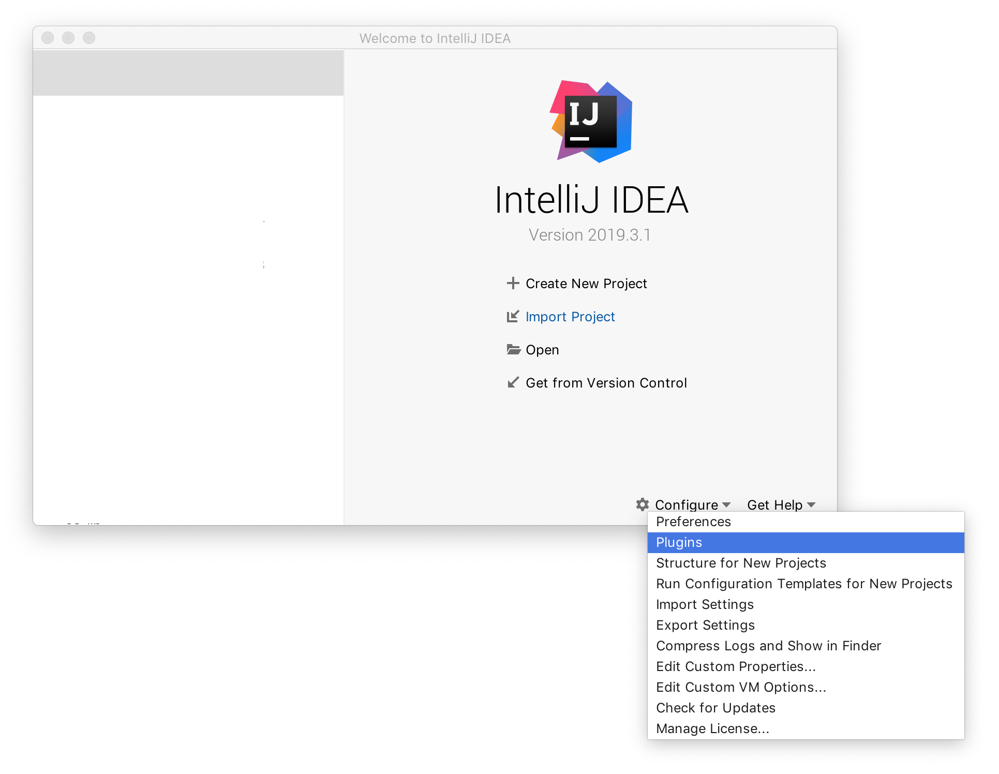
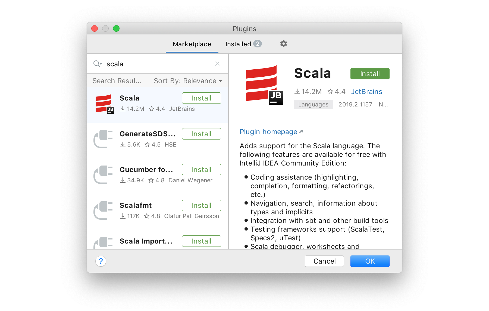
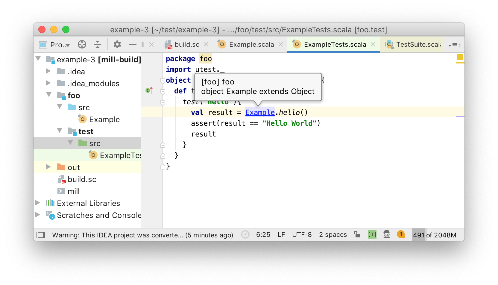
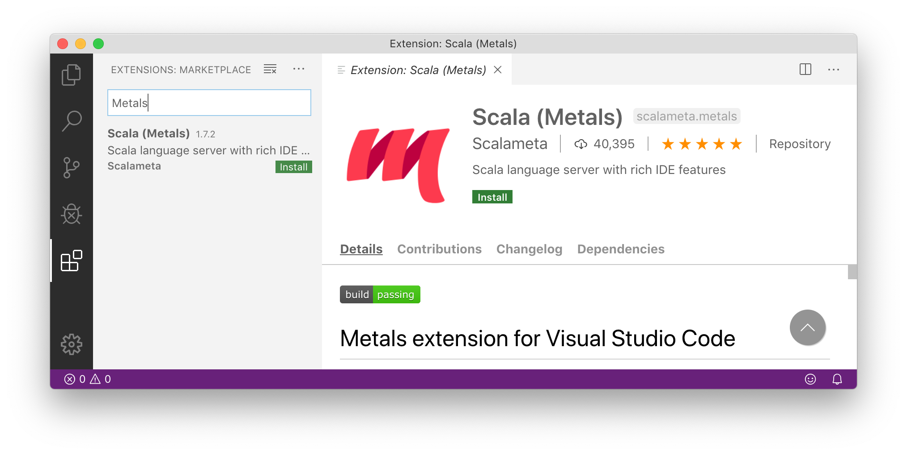
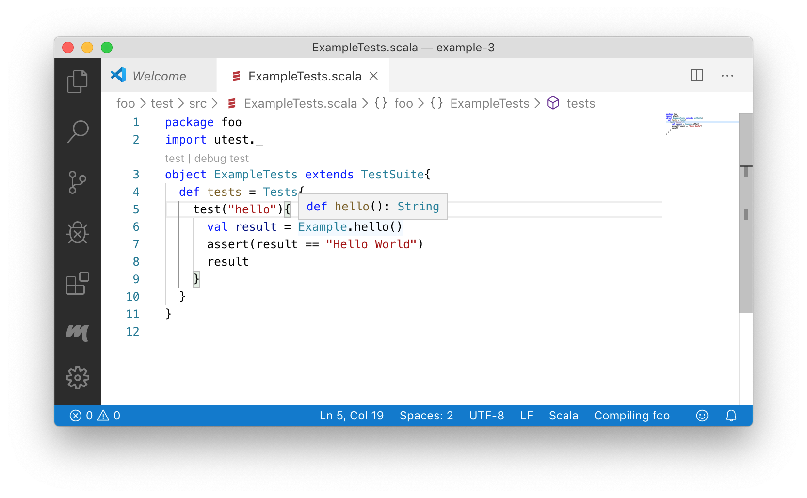

# 第2章：设置

- [2.1 Windows 安装（可选）](#2.1)
- [2.2 安装 Java](#2.2)
- [2.3 安装 Ammonite](#2.3)
- [2.4 安装 Mill](#2.4)
- [2.5 IDE 支持](#2.5)

```scala
$ amm
Loading...
Welcome to the Ammonite Repl 2.0.4 (Scala 2.13.1 Java 11.0.2)
@ 1 + 1
res0: Int = 2

@ println("hello world" + "!" * 10)
hello world!!!!!!!!!!
```

在本章中，我们将设置一个简单的 Scala 编程环境，让你能够编写、运行和测试 Scala 代码。这是一个简单的设置，但足以让你能立即进入 Scala 语言有趣的部分，并开始获得收获。

（代码片段：开始使用 Ammonite Scala REPL）

我们将安装以下工具来编写和运行 Scala 代码：

- **Java**：Scala 运行的底层运行时
- **Ammonite**：轻量级 REPL 和脚本运行器
- **Mill**：用于大型 Scala 项目的构建工具
- **IntelliJ IDEA**：支持 Scala 的集成开发环境
- **VSCode**：带有 Scala 支持的轻量级文本编辑器

这些工具将是你从第一行 Scala 代码到在 Scala 中构建和部署生产系统所需要的一切。

<a id="2.1"></a>
## 2.1 Windows 设置（可选）

如果你在 Windows 系统上使用 Scala，最简单的方法是使用 Linux 的 Windows 子系统2（WSL2）来提供一个类似 unix 的环境来运行代码。这可以通过遵循微软网站上的文档来完成。

- https://docs.microsoft.com/en-us/windows/wsl/wsl2-install

WSL2 允许你选择在你的 Windows 电脑上托管哪个 Linux 环境。在本书中，我们将使用 Ubuntu 18.04 长期支持版。

完成设置，你应该打开一个带标准 Linux 文件系统的 Ubuntu 终端，你的 Windows 文件系统在 /mnt/c 文件夹下。

```
$ cd /mnt/c
$ ls
'Documents and Settings'    PerfLogs        'Program Files (x86)'   Recovery
'Program Files'             ProgramData     Recovery.txt            Users
...
```

`/mnt/c` 中的文件在 Windows 和 Linux 环境间共享：

- 你可以在 Windows 上编辑代码，然后在 Linux 上通过终端运行。
- 你可以在 Linux 磁盘上生成文件，然后通过 Windows 资源管理器中查看它们。

<a id="2.2"></a>
## 2.2 安装 Java

Scala 语言运行在 Java 虚拟机（JVM）上，为了运行它需要 JVM 已安装。要检查 Java 是否已安装，打开命令行（在 Mac OS-X 系统上是 Terminal 应用）并键入 java -version 命令。如果看见下面的输出，意味着已安装 Java：

```
$ java -version
openjdk version "11.0.2" 2019-01-15
OpenJDK Runtime Environment 18.9 (build 11.0.2+9)
OpenJDK 64-Bit Server VM 18.9 (build 11.0.2+9, mixed mode)
```

如果你看到类似输出，可以跳到 安装 Ammonite（2.3）。另一方面，如果你看到以下内容，说明还没有安装 Java：

```
$ java -version
-bash: java: command not found
```

你可以通过以下网址之一下载并安装 JVM 的一个版本：

- https://adoptopenjdk.net/?variant=openjdk11&jvmVariant=hotspot
- https://docs.aws.amazon.com/corretto/latest/corretto-11-ug/downloads-list.html

安装说明因操作系统不同，但 Windows、Mac OS-X和不同版本的 Linux（.deb 和 .rpm 包）都有提供。当你下载并安装好 Java，回到命令行，确保运行 java -version 命令正确的产生上述输出。

如果你通过终端安装 Java，例如在 WSL Ubuntu 发行版或 headless 服务器上，可以通过标准的软件包管理器来安装。比如，在 Ubuntu 18.04 上意味着使用以下命令：

```
$ sudo apt update
$ sudo apt install default-jdk
$ java -version
openjdk version "11.0.6" 2020-01-14
OpenJDK Runtime Environment (build 11.0.6+10-post-Ubuntu1ubuntu118.04.1)
OpenJDK 64-Bit Server VM (build 11.0.6+10-post-Ubuntu-1ubuntu118.04.1, ...)
```

因为 Java 版本不用具有很高的兼容性，所以只要你安装了某个版本的 Java 就足以使本书中的例子工作，而不管它是哪个特定的版本。

<a id="2.3"></a>
## 2.3 安装 Ammonite

在 Mac OS-X 和 Linux 上，我们可以通过以下命令行命令来安装 Ammonite：

```
$ sudo curl -L https://github.com/lihaoyi/Ammonite/releases/download/2.0.4/2.13-2.0.4 \
  > /usr/local/bin/amm
$ sudo chmod +x /usr/local/bin/amm
$ amm
```

这应该会打开下面的 Ammonite Scala REPL：

```
Loading...
Welcome to the Ammonite Repl 2.0.4 (Scala 2.13.1 Java 11.0.2)
@
```

一旦看到这个输出，说明 Ammonite 已经准备好了。你可以使用 Ctrl + D 退出 Ammonite。

### 2.3.1 Scala REPL

打开 Ammonite REPL 后，你可以输入代码表达式，并将其结果打印回给你。

```sbtshell
@ 1 + 1
res0: Int = 2

@ "hello" + " " + "world"
res1: String = "hello world"

@ "i am cow".substring(2, 4)
res2: String = "am"
```

无效的代码将打印错误：

```sbtshell
@ 1 + 1
res0: Int = 2

@ "hello" + " " + "world"
res1: String = "hello world"

@ "i am cow".substring(2, 4)
res2: String = "am"
```

你可以在输入 . 后使用 TAB 补全来显示特定对象上有哪些方法可用：

```sbtshell
@ "i am cow".<tab>
...
exists                   maxOption                stripSuffix              ||
filter                   min                      stripTrailing
filterNot                minBy                    subSequence
find                     minByOption              substring
```

提供部分方法名来过滤这个列表：

```sbtshell
@ "i am cow".sub<tab>
subSequence   substring
```

或者提供一个完整的方法名，在这种情况下，Ammonite 将打印特定方法的方法签名（如果方法被重载，则打印多个签名）。

```sbtshell
@ "i am cow".substring
def substring(x$1: Int): String
def substring(x$1: Int, x$2: Int): String
```

如果 REPL 命令运行时间太久，可以通过 Ctrl-C 杀死它：

```sbtshell
@ while(true) { Thread.sleep(1000); println(1 + 1) } // loop forever
2
2
2
2
2
<Ctrl-C>
Interrupted! (`repl.lastException.printStackTrace` for details)

@
```

### 2.3.2 Scala 脚本
除了 REPL 之外，Ammonite 还支持 Scala 脚本文件。Scala 脚本是任何包含 Scala 代码的文件，（文件名）以 .sc 结尾。Scala 脚本是运行 Scala 代码的一种轻量级方式，虽然可配置性较差，但比使用像 Mill 这样的全功能构建工具更方便。

例如，我们可以创建以下 myScript.sc 文件，可以选择任何文本编辑器（Vim、Sublime Text、VSCode 等）：

```scala
println(1 + 1) // 2

println("hello" + " " + "world") // hello world

println(List("I", "am", "cow")) // List(I,am,cow)
```

注意，在脚本中你需要打印每个表达式，因为脚本不会回显出它们的值。之后，你可以通过执行 amm myScript.sc 运行脚本。

```
$ amm myScript.sc
Compiling (synthetic)/ammonite/predef/sourceBridge.sc
Compiling (synthetic)/ammonite/predef/frontEndBridge.sc
Compiling (synthetic)/ammonite/predef/DefaultPredef.sc
Compiling /Users/lihaoyi/myScript.sc
2
hello world
List(I, am, cow)
```

第一次运行脚本文件时，amm 将会花些时间编译脚本为可执行文件。之后的运行将更快，因为脚本已经编译好了。

```
$ amm myScript.sc
2
hello world
List(I, am, cow)
```

#### 2.3.2.1 观察脚本

如果你在单个脚本上工作，可以使用 amm -w 或 amm --watch 命令来观察一个脚本，并在发生变化时重新运行它。

```
$ amm -w myScript.sc
2
hello world
am
Watching for changes to 2 files... (Ctrl-C to exit)
```

现在，当你修改脚本文件时，它将自动重新编译并重新运行。这样比手动一遍又一遍地运行它快得多，而且当你正在积极地修改单个脚本以尝试使其正确运行时非常方便。

你可以使用任何觉得舒服的编辑器来编辑 Scala 脚本 。Intellij、VSCode（下面我们将安装这两种）或其它任何文本编辑器。

#### 2.3.2.2 PPrint

在脚本中可以使用 pprint.log 作为 println 的替代品。

```scala
val myList = List("I", "am", "cow")
println(myList)
// List(I,am,cow)
pprint.log(myList)
// myScript.sc:4 myList: List("I", "am", "cow")
```

```scala
val myMap = Map(
  1 -> "one",
  2 -> "two",
  3 -> "three",
  4 -> "four",
  5 -> "five",
  6 -> "six",
  7 -> "seven",
  8 -> "eight"
)
println(myMap)
// HashMap(5 -> five, 1 -> one, 6 -> six, 2 -> two, 7 -> seven, 3 -> three, 8 ->
// eight, 4 -> four)
pprint.log(myMap)
// myScript.sc:14 myMap: HashMap(
//   5 -> "five",
//   1 -> "one",
//   6 -> "six",
//   2 -> "two",
//   7 -> "seven",
//   3 -> "three",
//   8 -> "eight",
//   4 -> "four"
// )
```

pprint.log 使用了与 Ammonite Scala REPL 用来打印输入值相同的输出格式，还提供了一些便利，比如：显示 pprint.log 发生时所在的文件名和行号，显示被打印的表达式的名称（如上面的 myList 或 myMap），并在多行中打印的数据结构格式化，并以语法高亮显示。这可以让你更容易地掌握脚本中的打印内容，以及从哪里打印出来的。

### 2.3.3 在 REPL 中使用脚本

你可以通过使用 `--predef` 标志运行 `amm` 来打开一个可以访问 Scala 脚本中的函数的 REPL。例如，给定下面的脚本。

```scala
def hello(n: Int) = {
  "hello world" + "!" * n
}
```

那么你可以打开一个可以访问上面函数的 REPL，如下所示：

```
$ amm --predef myScript.sc
Loading...
Welcome to the Ammonite Repl 2.0.4 (Scala 2.13.1 Java 11.0.2)
@ hello(12)
res0: String = "hello world!!!!!!!!!!!!"
```

当你的代码片段足够大，你想把它保存到一个文件中，然后在一个合适的编辑器中编辑，但你还是想使用 Scala REPL来手动测试它的行为，这样很方便。

注意，如果修改了脚本文件，你需要使用 `Ctrl-D` 退出 REPL，并重新打开它来应用修改后的脚本。你也可以把 `--predef` 和 `--watch/-w` 结合使用，这样，当你使用 `Ctrl-D` 退出时，如果脚本文件发生变化，它将自动重新启动 REPL 。

<a id="2.4"></a>
## 2.4 安装 Mill

Mill 是一个用于 Scala 项目的构建工具，在处理较大的非琐碎的 Scala 项目时，它给了你更多的灵活性。虽然 Ammonite REPL 和脚本对于小块代码非常好，但它们缺乏对运行单元测试、打包代码、部署和其它任务的支持。对于需要类似东西的大型项目，你也需要使用像 Mill 这样的构建工具。

### 2.4.1 Mill 项目

获得 Mill 的最简单方式是使用以下命令下载示例项目：

```
$ curl http://www.lihaoyi.com/mill/example-3.zip > example-3.zip
$ unzip example-3.zip
$ cd example-3
$ find . -type f
./build.sc
./mill
./foo/test/src/ExampleTests.scala
./foo/src/Example.scala
```

你可以看到示例项目有4个文件，`build.sc` 文件包含了项目定义。定义了一个 `foo` 模块，它的内部有一个 `test` 测试模块。

```scala
import mill._, scalalib._

object foo extends ScalaModule{
  def scalaVersion = "2.13.1"
  object test extends Tests{
    def ivyDeps = Agg(ivy"com.lihaoyi::utest::0.7.3")
    def testFrameworks = Seq("utest.runner.Framework")
  }
}
```

`foo` 模块的 Scala 代码在 `foo/src/` 文件夹里面：

```scala
package foo
object Example{
  def main(args: Array[String]): Unit = {
    println(hello())
  }
  def hello(): String = "Hello World"
}
```

`foo.test` 测试模块的 Scala 代码在 `foo/test/src/` 文件夹里面：

```scala
package foo
import utest._
object ExampleTests extends TestSuite{
  def tests = Tests{
    test("hello"){
      val result = Example.hello()
      assert(result == "Hello World")
      result
    }
  }
}
```

和 `mill` 文件，你可以使用 `mill` 文件（通过 `./mill ...` ）来编译和运行项目：

```sbtshell
$ ./mill foo.compile
Compiling /Users/lihaoyi/test2/example-1/build.sc
...
7 warnings found
[info] Compiling 1 Scala source to /Users/lihaoyi/test2/example-1/out/foo/compile/dest...
[info] Done compiling.

$ ./mill foo.run
Hello World
```

注意，在你第一次运行 `./mill` 时，会花几秒钟的时间下载正确的 Mill 版本给你使用。虽然上面展示了 `./mill foo.compile` 和 `./mill foo.run` 的不同，但如果你想运行你的代码，可以直接运行 `./mill foo.run`，如果有必要它将在运行前重新编译代码。

要在其它项目中使用 Mill，或者用 Mill 启动一个全新的项目，只需将 mill 脚本文件复制到该项目的根目录即可。你也可以下载启动脚本：

```
$ curl -L https://github.com/lihaoyi/mill/releases/download/0.6.1/0.6.1 > mill
$ chmod +x mill
```

### 2.4.2 运行单元测试

要开始在 Mill 中进行测试，可以运行 `./mill foo.test`：

```
$ ./mill foo.test
-------------------------------- Running Tests --------------------------------
+ foo.ExampleTests.hello 10ms  Hello World
```

你可以使用文本编辑器添加更多代码到 `foo/src/Example.scala` 或者更多测试到 `foo/test/src/ExampleTests.scala` 等，来扩展这个程序。

*foo/src/Example.scala*

```scala
   def hello(): String = "Hello World"
+
+  def iAmCow(): String = "I am Cow"
 }
```

*foo/test/src/ExampleTests.scala*

```scala
     result
   }
+  test("iAmCow"){
+    val result = Example.iAmCow()
+    assert(result == "I am Cow")
+    result
+  }
 }
```

可以将 `foo.test` 模块中的所有测试一起运行。

```
$ ./mill foo.test
[info] Compiling 1 Scala source ...
[info] Done compiling.
-------------------------------- Running Tests -----------------------
+ foo.ExampleTests.hello 8ms  Hello World
+ foo.ExampleTests.iAmCow 0ms  I am Cow
```

或者单独的，通过将全限定路径传递给 TestSuite，运行其中的测试：

```
$ ./mill foo.test foo.ExampleTests.hello
--------------------- Running Tests foo.ExampleTests.hello ---
+ foo.ExampleTests.hello 8ms  Hello World

$ ./mill foo.test foo.ExampleTests.iAmCow
-------------------- Running Tests foo.ExampleTests.iAmCow -----------
+ foo.ExampleTests.iAmCow 7ms  I am Cow
```

注意，当测试成功时，`test()` 块中的最后一个表达式被打印出来到控制台。这可以让你对测试进行检查，有机会浏览测试中计算的一些值，以确保它们是合理的。如果我们引入一个失败测试，我们可以看到堆栈轨迹被打印出来。

```scala
   def hello(): String = "Hello World"

-  def iAmCow(): String = "I am Cow"
+  def iAmCow(): String = "Hear me Moo"
 }
```

```
$ ./mill foo.test
[info] Compiling 1 Scala source ...
[info] Done compiling.
-------------------------------- Running Tests -----------------------
+ foo.ExampleTests.hello 8ms  Hello World
X foo.ExampleTests.iAmCow 2ms
  utest.AssertionError: assert(result == "I am Cow")
  result: String = Hear me Moo
    utest.asserts.Asserts$.assertImpl(Asserts.scala:116)
    foo.ExampleTests$.$anonfun$tests$4(ExampleTests.scala:12)
1 targets failed
foo.test.test foo.ExampleTests foo.ExampleTests.iAmCow
```

### 2.4.3 创建独立可执行文件

到目前为止，我们只在 Mill 构建工具内运行代码。但如果我们想让代码在没有Mill的情况下运行，比如说部署到生产系统中？要做到这一点，你可以运行 `./mill foo.assembly`。

```
$ ./mill foo.assembly
```

这创建了一个 `out.jar` 文件，可以在没有 Mill 构建工具的情况下分发、部署和运行。默认，Mill 会在 `out/foo/assembly/dest` 目录中创建 `foo.assembly` 任务的输出，但你可以使用 `./mill show` 来要求 Mill 为你打印完整的路径：

```
$ ./mill show foo.assembly
"ref:18e58778:/Users/lihaoyi/test/example-3/out/foo/assembly/dest/out.jar"
```

你可以运行可执行程序来验证它是否符合你的要求：

```
$ out/foo/assembly/dest/out.jar
Hello World
```

现在你的代码已经准备好部署了！

一般来说，在 Mill 项目里运行 Scala 代码要比在 Ammonite Scala REPL 或 Scala 脚本中交互运行需要更多的设置，但对于从“实验”成长为真正的生产软件的程序来说，能够轻松地测试和打包代码是至关重要的。

### 2.4.4 添加第三方依赖

虽然 Ammonite REPL 脚本和脚本附带了一些第三方库，但为了方便起见，Mill 项目在启动时故意不附带任何依赖，让你可以完全灵活地进行配置。例如，如果想使用我们前面看到的 `pprint.log` 函数，你需要在 `pprint` 模块上添加明确的依赖，如下所示：

```scala
 import mill._, scalalib._

 object foo extends ScalaModule{
   def scalaVersion = "2.13.1"
+  def ivyDeps = Agg(
+    ivy"com.lihaoyi::pprint:0.5.6"
+  )
   object test extends Tests{
     def ivyDeps = Agg(ivy"com.lihaoyi::utest::0.7.3")
     def testFrameworks = Seq("utest.runner.Framework")
   }
 }
```

随着本书的进展，当我们遇到其它第三方库时，我们将提供必要的 `ivy"..."` 声明，以便在 Mill 构建中使用该库。

<a id="2.5"></a>
## 2.5 IDE 支持

使用 Scala 程序最常用的编辑器是 IntelliJ 和 VSCode。本节将指导你安装它们，但只需要安装你喜欢的其中一个就可以完成本书（的代码示例）。

### 2.5.1 安装 IntelliJ

要安装 IntelliJ，可以从下面站点下载它：[https://www.jetbrains.com/idea/download](https://www.jetbrains.com/idea/download) 免费的社区版就够我们用了。接下来，我们需要安装 Scala 插件。我们可以通过加载屏幕访问 IntelliJ 的首选项来实现：



或者通过菜单栏：


从这里，进入插件页面：



搜索 Scala 并点击 Install。安装后你需要重新启动编辑器。

### 2.5.2 集成 IntelliJ 与 Mill

一旦机器上安装好 IntelliJ，你可以通过下面的终端命令告诉它加载你的 Mill 项目：

```
$ ./mill mill.scalalib.GenIdea/idea
```

接下来，使用 IntelliJ 的 File / Open 菜单项选择你的 `build.sc` 文件所在的文件夹。这将打开 Mill 项目，在编辑代码时，IntelliJ 将提供代码辅助。



你可能会在窗口顶部见到 `Project JDK is not defined: Setup JDK` 提示。在这种情况下，点击 `Setup JDK` 链接并选择先前安装的 Java 版本。注意，每当你更改 `build.sc` 添加依赖或新模块时，都需要重新运行 `./mill mill.scalalib.GenIdea/idea` 命令，然后重启 IntelliJ 使其接受更改。

### 2.5.3 Visual Studio Code 支持

Scala 也支持 Visual Studio Code 文本编辑器：

- <https://code.visualstudio.com/>

要使用 VSCode 的 Scala 支持，请安装 Metals 插件：



要在 Mill 构建中使用 VSCode，我们需要在 .mill-version 文件中指定 Mill 版本：

```
$ echo "0.6.1" > .mill-version
```

接下来，打开你的 Mill构建所在的文件夹，然后选择 `Import build`：


你应该能够将鼠标放到方法或变量上面，并使用 `Cmd` 或 `Ctrl` 键弹出它们的签名：



Metals 插件也支持其它文本编辑器，如：Vim、Sublime Text、Atom 等。有关详细信息，请参阅它们的文档来了解如何安装相关的编辑器插件：

- https://scalameta.org/metals/docs/editors/overview.html

<a id="2.6"></a>
## 2.6 结尾

到现在，你应该学会三种主要设置方法：

- Ammonite Scala REPL 和脚本运行器，你可以通过 `amm` 或 `amm myScript.sc` 运行
- 你可以通过 `./mill foo.run` 或 `./mill foo.test` 来运行或测试 Mill 示例项目
- 对你的 Mill 示例项目的 IntelliJ 或 VSCode 支持

随着使用 Scala 的经验越来越丰富，你很可能会在各种 Scala 中遇到其它构建工具：

- SBT: [https://www.scala-sbt.org/](https://www.scala-sbt.org/)
- Gradle: [https://docs.gradle.org/current/userguide/scala_plugin.html](https://docs.gradle.org/current/userguide/scala_plugin.html)
- Maven: [https://docs.scala-lang.org/tutorials/scala-with-maven.html](https://docs.scala-lang.org/tutorials/scala-with-maven.html)

在本书中我们将使用 Mill 作为主要的构建工具，因为它是最容易上手使用的。在你进入下面的章节之前，花点时间来实验下这些工具：在 Ammonite REPL 中写点代码，创建些脚本，在 Mill 示例项目中添加代码和测试，然后运行它们。这些都是我们在本书中会用到的主要工具。

